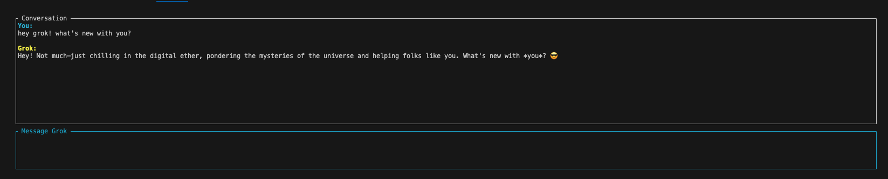
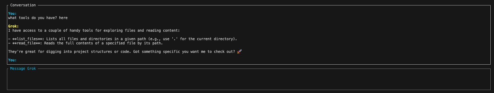
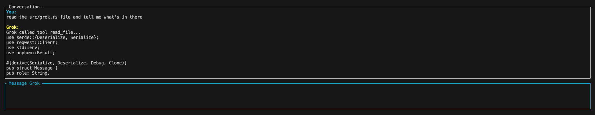

# grok-cli

A powerful, TUI-based CLI client for Grok, featuring tool-calling capabilities that allow the AI to interact with your local file system.

## Features

- **Terminal UI (TUI):** A clean and responsive interface built with `ratatui`.
- **Tool Calling:** Grok can automatically list and read files in your project to provide better context.
- **Chat History:** Maintains conversation context within the session.
- **Async Runtime:** Powered by `tokio` for a smooth experience.

## Prerequisites

You need an xAI API key to use this tool.

1. Get your API key from [x.ai Console](https://console.x.ai/).
2. Create a `.env` file in the project root:
   ```env
   XAI_API_KEY=your_api_key_here
   ```

## Installation

```bash
# Clone the repository
git clone https://github.com/abhaykashyap03/grok-cli.git
cd grok-cli

# Build and install locally
cargo install --path .
```

## Usage

Run the CLI using:
```bash
cargo run
```

### Controls
- **Enter:** Send your message to Grok.
- **Up/Down:** Scroll through the chat history.
- **Esc:** Quit the application.

## AI Tools

Grok is equipped with the following tools to help you explore your codebase:
- `list_files(path)`: Lists files and directories in a given path.
- `read_file(path)`: Reads the content of a specific file.

## Screenshots

#### First message


#### Tools


#### Example tool usage

